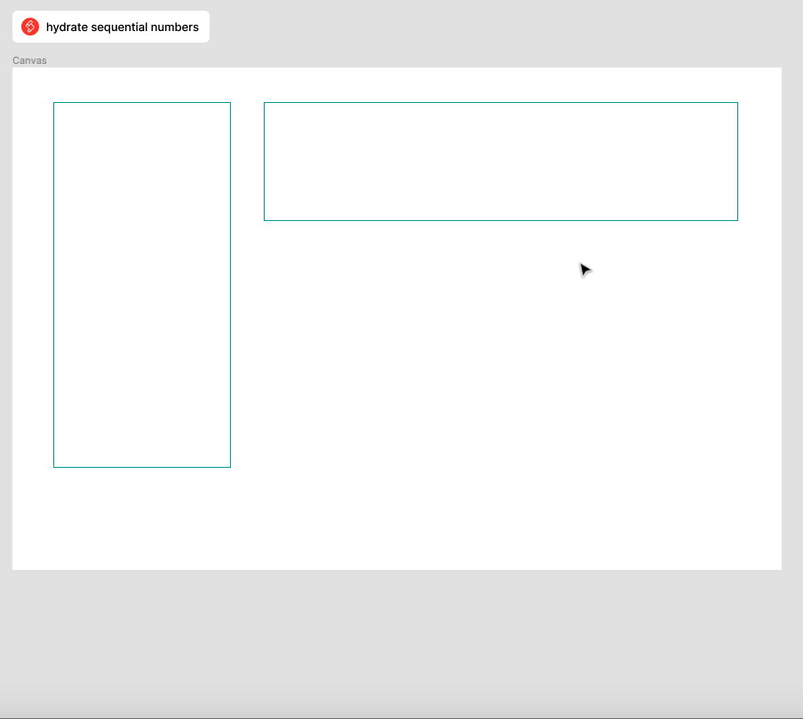

# Tally Scripts

Takes a selected `SceneNode` instance and will both ensure it has the appropriate _Auto Layout_ settings, then populate it with a controlled set of rows and columns containing numbers incrementing by 1.

Works for port portrait and landscape based containers
